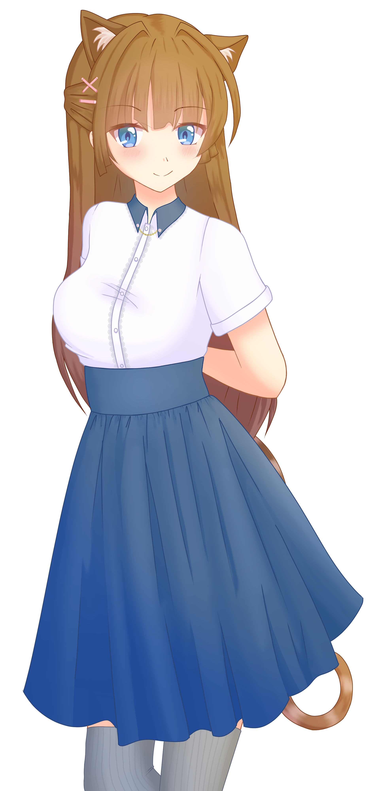

# 📸 Screenshots

## 🎭 Giao diện chính

### Nhân vật Nora Cat

*Nhân vật Nora Cat với trang phục thường ngày*

### Các trang phục khác nhau
- **Summer Uniform**: Trang phục đồng phục mùa hè
- **Winter Uniform**: Trang phục đồng phục mùa đông
- **Casual**: Trang phục thường ngày (mặc định)

## 🎮 Tính năng tương tác

### Click vào nhân vật
- Nhân vật sẽ đỏ mặt và phát âm thanh
- Biểu cảm thay đổi tự động
- Hiệu ứng animation mượt mà

### Thông báo nhắc nhở
- Xuất hiện mỗi 5 phút
- Có mũi tên chỉ xuống nhân vật
- Chứa lời nhắc nhở nghỉ ngơi

### Điều khiển âm thanh
- Nút 🔊 để bật/tắt âm thanh
- Âm thanh anime thật từ file MP3
- Tự động phát khi có tương tác

## 🎨 Giao diện UI

### Panel thông tin
- Hiển thị thông tin nhân vật
- Credit đầy đủ cho sprite
- Thiết kế đẹp mắt

### Menu trang phục
- Nút 👗 để mở menu
- Chọn trang phục dễ dàng
- Thay đổi ngay lập tức

### Nút đóng ứng dụng
- Nút ✕ để đóng app
- Vị trí thuận tiện
- Thiết kế nhất quán

## 🔧 Cài đặt và sử dụng

### Development
```bash
npm run dev
```

### Production
```bash
npm run build
npm run start
```

### Build executable
```bash
npm run electron:pack
```

## 📱 Tương thích

- ✅ Windows 10/11
- ✅ macOS 10.14+
- ✅ Linux (Ubuntu, Debian, etc.)

## 🎯 Đặc điểm nổi bật

- **Cửa sổ trong suốt**: Không che khuất desktop
- **Click-through**: Có thể tương tác với app bên dưới
- **Luôn ở trên cùng**: Không bị che bởi app khác
- **Performance tốt**: Sử dụng ít tài nguyên
- **Dễ tùy chỉnh**: Code rõ ràng, dễ sửa đổi
